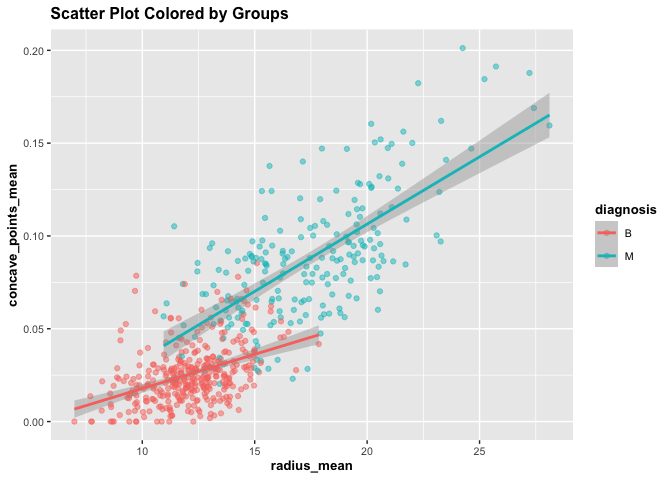
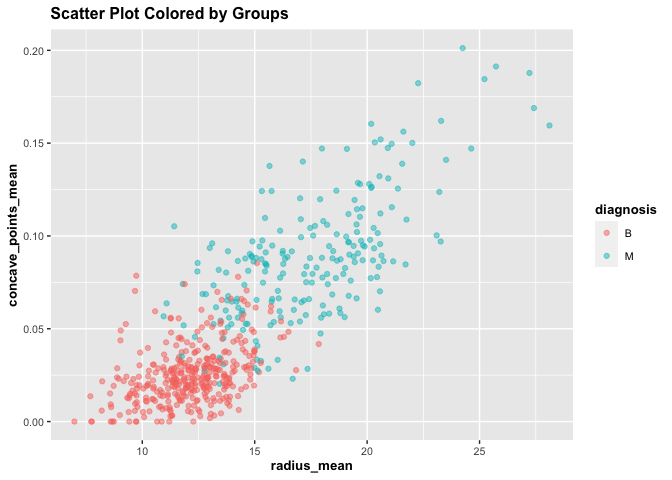

Assignment B1
================
Xiao Hu

``` r
library(datateachr) # <- might contain the data you picked!
library(tidyverse)
library(broom)
library(testthat)
```

# Exercise 1: Make a Function

A special plot that can be repeated when exploring data.

# Exercise 2: Document your Function

In the same code chunk where you made your function, document the
function using roxygen2 tags. Be sure to include: \* Title. \* Function
description: In 1-2 brief sentences, describe what the function does. \*
Document each argument with the @param tag, making sure to justify why
you named the parameter as you did. (Justification for naming is not
often needed, but we want to hear your reasoning.) \* What the function
returns, using the @return tag.

``` r
#' Scatter Plot of Two Continuous Variables Colored by Categorical Groups
#'
#' Plot a scatter plot of two continuous variables and colored the points
#' by a categorical group. The aesthetic of plot is by default.
#' A wrapper for \code{tidyverse::ggplot()}. 
#' 
#' @param data Data frame containing the data.
#' @param x Character of name of first continuous variable from the data frame to pass to 
#' \code{tidyverse::ggplot()}. This is the x variable of the scatter plot.
#' @param y Character of name of second continuous variable from the data frame to pass to 
#' \code{tidyverse::ggplot()}. This is the y varaible of the scatter plot.
#' @param group Character of name of categorical variable that points are be colored by
#' @param lm If \code{TRUE} (the default), uses the \code{geom_smooth()} function
#' to fit a linear regression line to the scatter plot. If \code{FALSE}, 
#' there is no linear regression line.
#'
#' @return A plot
#' @export

scatter_bygroup <- function(data, x, y, group, lm = TRUE){
  
  if(!(is.character(x)&is.character(y)&is.character(group))) {
    stop('I am so sorry, but this function only works for character inputs!')
  }
  g <- data %>% 
  ggplot(aes(data[[x]], data[[y]], color = data[[group]])) +
  geom_point(size = 1.5,
             alpha = 0.5) +
  labs(title = "Scatter Plot Colored by Groups",
       color = group, 
       x = x, 
       y = y)+
  theme(
    text = element_text(size = 10),
    plot.title = element_text(face = "bold"),
    axis.title = element_text(face = "bold"),
    legend.title = element_text(face = "bold"),
  )

  if (lm) {
      g <- g + geom_smooth(method = "lm", formula = y ~ x)
  }
  
  return (g)
}
```

# Exercise 3: Include examples

Plot a scatter plot of radius_mean and concave_points_mean colored by
diagnosis with a linear regression line.

``` r
exp_1 <- scatter_bygroup(cancer_sample, "radius_mean", "concave_points_mean", "diagnosis")
exp_1
```

<!-- --> Plot a scatter
plot of radius_mean and concave_points_mean colored by diagnosis without
a linear regression line.

``` r
exp_2 <- scatter_bygroup(cancer_sample, "radius_mean", "concave_points_mean", "diagnosis",FALSE)
exp_2
```

<!-- -->

# Exercise 4: Test the Function

I used three non-redundant uses of an expect\_() function from the
testthat package: `expect_true()`, `expect_false()` and `expect_error()`

Test whether all aesthetic setting work:

``` r
test_1 <- scatter_bygroup(cancer_sample, "area_mean", "concavity_mean", "diagnosis")
test_that("non-redundant inputs: no NA’s", {
    geoms <- test_1$layers %>% 
              map("geom") %>% 
              map(class) %>% 
              map_chr(1)
  
    expect_true("GeomPoint" %in% geoms)
    expect_true("GeomSmooth" %in% geoms)
  
    expect_true("x" %in% names(test_1$mapping))
    expect_true("y" %in% names(test_1$mapping))
    expect_true("colour" %in% names(test_1$mapping))
    
    expect_true(all(ggplot_build(test_1)$data[[1]]$alpha == 0.5))
    expect_true(all(ggplot_build(test_1)$data[[1]]$size == 1.5))
    
    expect_true("data[[group]]" %in% as_label(test_1$mapping$colour))
    expect_true("data[[x]]" %in% as_label(test_1$mapping$x))
    expect_true("data[[y]]" %in% as_label(test_1$mapping$y))
})
```

    ## Test passed 😀

Test when `lm` = `FALSE`, whether there is no linear regression line:

``` r
test_2 <- scatter_bygroup(cancer_sample, "area_mean", "concavity_mean", "diagnosis",FALSE)
test_that("redundant inputs: different input", {
    geoms <- test_2$layers %>% 
              map("geom") %>% 
              map(class) %>% 
              map_chr(1)
  
    expect_true("GeomPoint" %in% geoms)
    expect_false("GeomSmooth" %in% geoms)
})
```

    ## Test passed 🎉

Test whether error is threw when type of input is incorrect

``` r
test_that("non-redundant inputs: different type", {
   expect_error(scatter_bygroup(cancer_sample, 1, "concave_points_mean", "diagnosis",FALSE), 
                "I am so sorry, but this function only works for character inputs!" )
})
```

    ## Test passed 🥇
