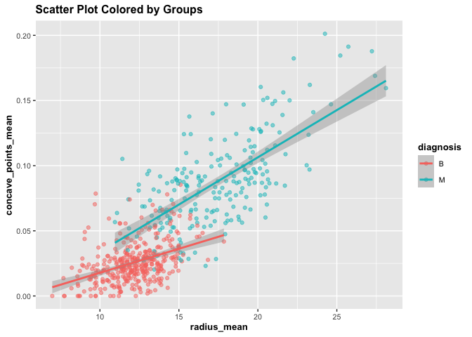

<!-- README.md is generated from README.Rmd. Please edit that file -->

# autoplot

<!-- badges: start -->
<!-- badges: end -->

The goal of autoplot is to plot informative graphs with at least three
variables by using facetting or an aesthetic like colour

## Installation

You can install the development version of autoplot from
[GitHub](https://github.com/stat545ubc-2022/assignment_b1_and_b2_xiaohu1122)
with:

``` r
# install.packages("devtools")
devtools::install_github("https://github.com/stat545ubc-2022/assignment_b1_and_b2_xiaohu1122", build_vignettes = FALSE, ref = "0.1.2")
```

## Example

This is a basic example which shows you how to solve a common problem:

``` r
library(autoplot)
## basic example code
library(datateachr)
scatter_bygroup(cancer_sample, "radius_mean", "concave_points_mean", "diagnosis")
```


